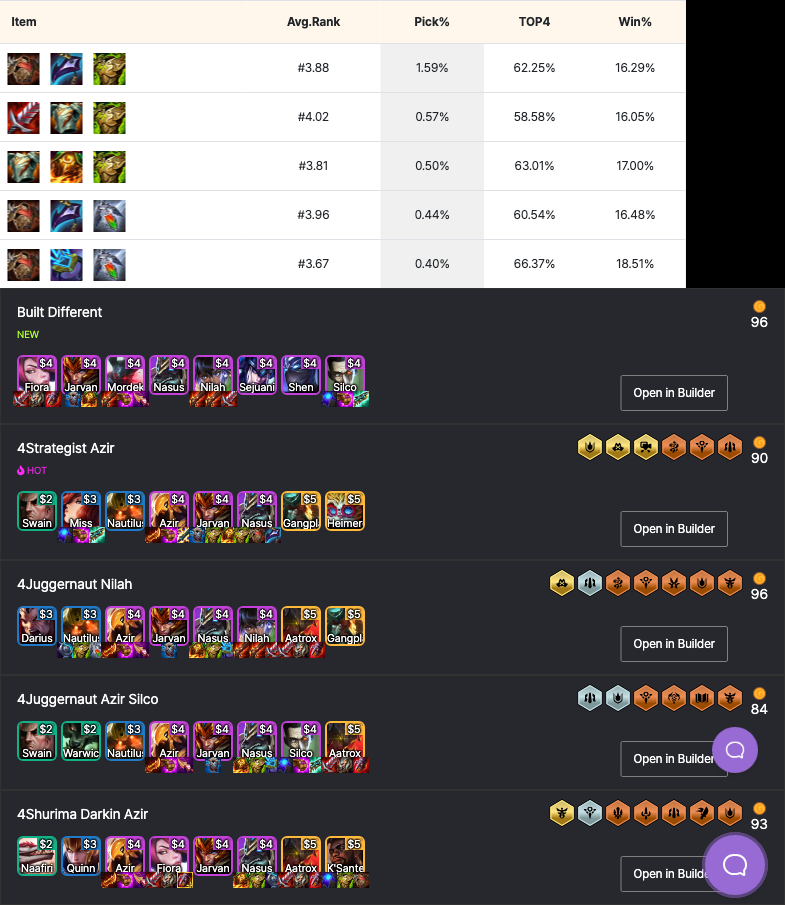

I love to play TFT, as many players I want to check items and comps that suitable for one champion.

This tool helps to generate an image that contains items build and comps for the champion from [lolchess.gg](https://lolchess.gg)

You don't need to enter the champion name correctly, this tool will try to fuzzy guess the champion name.


#### Show me!

```bash
./run.sh nasus
```


